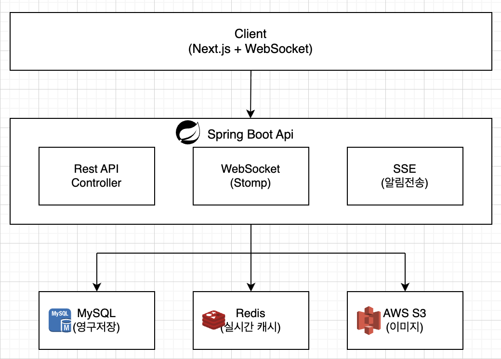
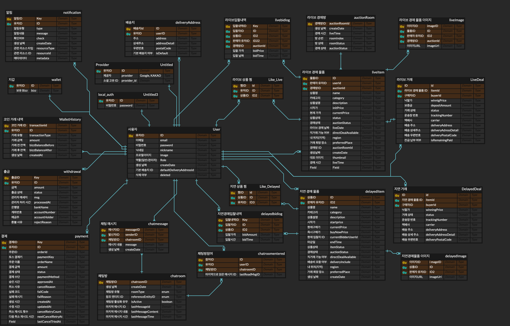
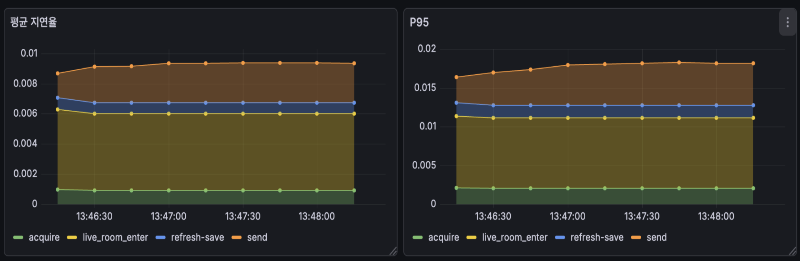

# 🔔 BuzzerBidder

> **실시간 라이브 경매 플랫폼** - 희소성 있는 물품을 실제 경매장처럼 사고파는 온라인 경매 서비스

[](https://openjdk.org/)
[](https://spring.io/projects/spring-boot)
[](https://redis.io/)
[](https://www.mysql.com/)

🔗 **배포 URL**: [https://buzzerbidder.site](https://buzzerbidder.site)

📂 **Frontend Repository**: [WEB6_7_DEVut_FE](https://github.com/prgrms-web-devcourse-final-project/WEB6_7_DEVut_FE)

📂 **Backend Repository**: [WEB7_9_DEVut_BE](https://github.com/prgrms-web-devcourse-final-project/WEB7_9_DEVut_BE)

<br/>

<p align="center">
  
</p>

<br/>

## 📋 프로젝트 소개

### 배경
기존 온라인 경매 서비스(크림, 스탁엑스, 중고나라 등)는 **표 기반 UI**와 **시간제한 없는 입찰 구조**로 인해 실제 경매장의 긴장감과 몰입감을 제공하지 못합니다.

BuzzerBidder는 **실시간 라이브 경매**를 통해 실제 경매장에서 느낄 수 있는 긴장감 있는 입찰 경험을 온라인으로 구현합니다.

### 주요 타겟
- 스니커즈, 피규어, 한정판 등 수집/리셀 매니아
- 라이브커머스에 익숙한 MZ세대
- 빠른 판매를 원하는 소상공/개인 판매자

<br/>

## 🎯 핵심 기능

### 1. 라이브 경매
| 기능 | 설명 |
|------|------|
| **실시간 입찰** | WebSocket 기반 실시간 입찰, 최고가 즉시 반영 |
| **경매방 시스템** | 시간대별 경매방 운영, 최대 6개 상품 연속 경매 |
| **실시간 채팅** | 경매 참여자 간 단체 채팅 |
| **입찰 알림** | SSE를 통한 경매 시작/종료/낙찰 알림 |

### 2. 일반(지연) 경매
| 기능 | 설명 |
|------|------|
| **봉인 입찰** | 3~10일 기간 내 비공개 입찰 |
| **즉시 구매** | 즉구가 설정 시 바로 구매 가능 |
| **1:1 채팅** | 판매자-구매자 간 DM |

### 3. 결제 및 재화
| 기능 | 설명 |
|------|------|
| **BIZZ 코인** | 서비스 내 가상 화폐 시스템 |
| **토스페이먼츠** | 실결제 연동 (카드, 간편결제) |
| **보증금 시스템** | 입찰가의 20% 보증금 예치 |

<br/>

## 🛠 기술 스택

### Backend
| 구분 | 기술 |
|------|------|
| **Language** | Java 21 |
| **Framework** | Spring Boot 3.5, Spring Data JPA |
| **Security** | Spring Security, JWT, OAuth2 (Kakao, Naver, Google) |
| **Database** | MySQL 8.0, H2 (dev) |
| **Cache** | Redis, Redisson |
| **Real-time** | WebSocket (STOMP), SSE |
| **Message** | Redis Streams |
| **Payment** | Toss Payments API |
| **Storage** | AWS S3 |
| **Monitoring** | Prometheus, Grafana, Micrometer |
| **Resilience** | Resilience4j (Circuit Breaker, Retry) |
| **Test** | JUnit 5, TestContainers |
| **Docs** | SpringDoc OpenAPI (Swagger) |

### Infrastructure
| 구분 | 기술 |
|------|------|
| **Cloud** | AWS EC2, S3 |
| **Container** | Docker |
| **CI/CD** | GitHub Actions |
| **Env** | Doppler |

<br/>

## 🏗 시스템 아키텍처

<p align="center">
  
</p>

### 저장소 전략: DB + Redis 이중화

| 상황 | 저장소 | 이유 |
|------|--------|------|
| **평시** | MySQL | 안정적인 영구 저장 |
| **라이브 경매 중** | Redis | 실시간 입찰 경쟁을 위한 고속 처리 |

```
[라이브 경매 시작]
     │
     ▼
┌─────────────────────────────────────┐
│  Redis에 경매 데이터 캐싱               │
│  - 최고가, 입찰자, 보증금 정보            │
│  - ZSET으로 종료 시간 관리              │
└─────────────────────────────────────┘
     │
     ▼
[경매 종료 시 DB에 최종 데이터 동기화]
```

### ERD

<p align="center">
  
</p>

<br/>

## 💡 기술적 도전과 해결

### 1. 라이브 경매 동시 입찰 - Redis Lua Script

**문제**: 수백 명이 동시에 입찰할 때 데이터 일관성 보장 필요

**해결**: Redis Lua Script로 원자적 연산 구현

```lua
-- 입찰 처리 Lua Script (단순화)
-- 1. 현재 최고가 확인
-- 2. 입찰가 검증
-- 3. 이전 입찰자 보증금 환불
-- 4. 새 입찰자 보증금 차감
-- 5. 최고가 갱신
-- 모든 작업이 원자적으로 실행됨
```

**추가 최적화**:
- **ZSET**으로 경매 시작/종료 시간 관리 → 시간 기반 정렬 조회 비용 절감
- **Redis Stream**으로 입찰 로그를 비동기로 DB에 안전하게 전달
- 스케줄러 **0.2초** 간격으로 경매 시작 타이밍 정밀 제어

**결과**: 동시 입찰 시에도 중간 상태 없이 일관성 보장, **입찰 응답 시간 10ms 이하**

---

### 2. 일반 경매 동시성 - 비관적 락

**문제**: 일반 경매에서 동시 입찰 시 데이터 정합성 보장 필요

**해결**: JPA 비관적 락으로 순차 처리

```
입찰 요청 → 비관적 락 획득 → 최고가 검증 → 이전 입찰자 환불 → 새 입찰 처리 → 락 해제
```

**자동화**:
- 스케줄러가 **1분마다** 종료 시간 체크
- 입찰자 있으면 거래 생성, 없으면 유찰 처리
- 즉시 구매 시 스케줄러 대기 없이 즉시 낙찰

---

### 3. 실시간 통신 분리 - WebSocket vs SSE

**문제**: 모든 실시간 기능에 WebSocket을 사용하면 서버 부하 증가

**해결**: 용도에 따른 프로토콜 분리

| 프로토콜 | 용도 | 특징 |
|----------|------|------|
| **WebSocket** | 경매방 내부 (입찰, 채팅) | 양방향, 저지연 필수 |
| **SSE** | 외부 알림 (낙찰, 상태변경) | 단방향, 가볍고 확장성 높음 |

---

### 4. 알림 시스템 - Event-Driven Architecture

**문제**: 알림 로직이 비즈니스 로직에 결합되면 유지보수 어려움

**해결**: Spring Event로 느슨한 결합 구현

```
[도메인 이벤트 발행] → [EventListener 구독] → [알림 생성] → [SSE 전송]
```

**장점**:
- 새 알림 타입 추가 시 기존 코드 수정 불필요
- 17종의 알림 타입을 유연하게 관리

---

### 5. 세션 안정성 - Heartbeat 메커니즘

**문제**: 네트워크 불안정 시 경매 참여가 끊기는 문제

**해결**: Redis 기반 세션 관리 + Heartbeat

```
세션 TTL(35초) > Heartbeat 주기(30초)
→ 일시적 연결 끊김에도 세션 유지
```

---

### 6. 모니터링 - Prometheus + Grafana

**구성**: Micrometer + Actuator → Prometheus → Grafana

**특징**:
- PromQL을 **변수 기반으로 공통화** → 새 서비스 추가 시 기존 쿼리 재사용
- JMeter 부하 테스트와 연동하여 실시간 메트릭 확인

<br/>

## 📊 성능 테스트 결과

### 테스트 환경
- **도구**: JMeter + Prometheus + Grafana
- **시나리오**: 500명 동시 접속, 초당 25~30건 채팅 전송

### 결과

| 지표 | 수치 |
|------|------|
| **평균 지연** | 9ms |
| **P95 지연** | 17ms |
| **처리량** | 25~30 msg/sec |

<p align="center">
  
</p>

<br/>

## 🗂 프로젝트 구조

```
src/main/java/devut/buzzerbidder/
├── domain/                      # 도메인별 모듈
│   ├── auction/                 # 경매 스케줄링
│   ├── auctionroom/             # 라이브 경매방
│   ├── chat/                    # 채팅 (DM, 그룹)
│   ├── deal/                    # 거래 관리
│   ├── delayedbid/              # 일반 경매 입찰
│   ├── delayeditem/             # 일반 경매 상품
│   ├── liveBid/                 # 라이브 입찰 (Redis)
│   ├── liveitem/                # 라이브 경매 상품
│   ├── notification/            # 알림 시스템
│   ├── payment/                 # 결제 (토스)
│   ├── user/                    # 회원/인증
│   └── wallet/                  # BIZZ 지갑
├── global/                      # 공통 모듈
│   ├── config/                  # 설정 (WebSocket, Redis, Security)
│   ├── exception/               # 예외 처리
│   ├── image/                   # S3 이미지 업로드
│   └── security/                # JWT, OAuth2
└── BuzzerBidderApplication.java
```

<br/>

## 👥 팀원 및 역할

### Backend (6명)

| 이름 | 역할 | 담당 도메인 |
|------|------|-------------|
| [**이유찬**](https://github.com/imlabtory) | PO | 재화(Wallet), 거래(Deal) |
| [**도석환**](https://github.com/do04080) | BE 팀장 | 회원(User), 인증/인가 |
| [**구본황**](https://github.com/BE9koo) | AWS 담당 | 경매방(AuctionRoom), 경매글(LiveItem) |
| [**권태현**](https://github.com/xoxoisme) | - | 결제(Payment), 성능 테스트/모니터링 |
| [**박종원**](https://github.com/premierbell) | - | 일반 경매(DelayedItem), 알림(Notification), 이미지 |
| [**이현**](https://github.com/lh922) | - | 라이브 입찰(LiveBid), 채팅(Chat) |

### Frontend (3명)

| 이름 | 역할 | 담당 기능 |
|------|------|-----------|
| [**이현준**](https://github.com/leehyunjun97) | FE 팀장 | 상품 검색/조회, 실시간 경매방 |
| [**송주원**](https://github.com/singilwon) | - | 마이페이지, Bizz 충전, 찜 |
| [**안수민**](https://github.com/mandububsa) | - | 인증인가, DM, 시간표/글작성 |

<br/>

## 📅 개발 기간

**2025.12.03 ~ 2026.01.07** (약 5주)

---

<p align="center">
  <b>프로그래머스 데브코스 백엔드 7기 9회차 - Team DEVut</b>
</p>
